# Customer Churn Intelligence Platform

An end-to-end machine learning platform for predicting customer churn, explaining model predictions, and providing actionable customer insights through a production-style web application.

## Table of Contents

- [Project Overview](#-project-overview)
- [Production Deployment](#-production-deployment)
- [Business Objective](#-business-objective)
- [System Architecture](#-system-architecture)
- [Machine Learning Workflow](#-machine-learning-workflow)
- [Dataset](#-dataset)
- [Machine Learning Model](#-machine-learning-model)
- [Explainable AI](#-explainable-ai)
- [Application Features](#-application-features)
- [FastAPI REST API](#-fastapi-rest-api)
- [Docker](#-docker)
- [Project Structure](#-project-structure)
- [Technologies](#-technologies)
- [Local Development](#-local-development)
- [Run with Docker Compose](#-run-with-docker-compose)
- [Testing](#-testing)
- [Key Project Highlights](#-key-project-highlights)
- [Author](#-author)
- [License](#-license)

## 🚀 Project Overview

Customer churn is a major business challenge for subscription-based companies.

This project builds a complete machine learning solution that:

- Predicts whether a customer is likely to churn.
- Provides the churn probability.
- Explains individual predictions using SHAP.
- Supports single-customer prediction.
- Supports batch predictions through CSV files.
- Provides model performance analysis.
- Exposes predictions through a FastAPI REST API.
- Provides an interactive Streamlit interface.
- Runs through Docker and Docker Compose.

## 🌐 Production Deployment

The platform is live in production. The application is containerized with Docker and deployed on **Render**.

- [Live Streamlit App](https://customer-churn-platform-front.onrender.com/)
- [Batch Prediction](https://customer-churn-platform-front.onrender.com/Batch_Prediction)
- [FastAPI API](https://customer-churn-platform-xbe4.onrender.com/)
- [API Documentation (Swagger)](https://customer-churn-platform-xbe4.onrender.com/docs)
- [API Health Check](https://customer-churn-platform-xbe4.onrender.com/health)

**Production Architecture**

```text
User → Streamlit Frontend → FastAPI Backend → ML Prediction Pipeline → Prediction Result
```

## 🎯 Business Objective

The primary objective is to identify customers who are at high risk of churn so that businesses can take proactive retention actions.

The platform transforms customer data into:

**Customer Data → ML Prediction → Churn Risk → Explanation → Business Decision**

## 🏗️ System Architecture

```text
                     Customer Data
                          │
                          ▼
              ┌────────────────────────┐
              │   Data Preprocessing   │
              │   & Feature Engineering│
              └────────────┬───────────┘
                           │
                           ▼
              ┌────────────────────────┐
              │  Machine Learning      │
              │  Model (Random Forest) │
              └────────────┬───────────┘
                           │
              ┌────────────┴────────────┐
              ▼                         ▼
        Streamlit UI              FastAPI REST API
              │                         │
       ┌──────┴──────┐                  ▼
       ▼             ▼            REST Clients
Business Users   SHAP
                 Explanations
```

## 🧠 Machine Learning Workflow

The project follows an end-to-end ML workflow:

1. Exploratory Data Analysis
2. Data Cleaning
3. Feature Engineering
4. Data Preprocessing
5. Train/Test Split
6. Model Training
7. Model Evaluation
8. Explainable AI
9. Prediction Services
10. Application Development
11. API Development
12. Dockerization
13. Production Testing

## 📊 Dataset

The project uses the IBM Telco Customer Churn dataset containing **7,043** customers.

The dataset contains customer demographic, service, contract, billing, and churn-related information. The machine learning model uses customer features available at prediction time to predict the customer's churn status against the binary target column (`Churn Label`).

## 🤖 Machine Learning Model

The final model is based on a **Random Forest Classifier**. The performance summary is available in `reports/training_summary.csv`:

| Metric | Value |
| --- | --- |
| Best Model | Random Forest |
| Cross-Validation AUC | 0.8602 |
| Test ROC AUC | 0.853 |
| Best Prediction Threshold | 0.35 |
| Precision | 0.5705 |
| Recall | 0.7246 |
| F1 Score | 0.6384 |

The trained artifacts (in `models/`) include:

- Trained classification model (`final_churn_model.pkl`)
- Preprocessing pipeline (`preprocessor.pkl`)
- Churn prediction threshold (`best_threshold.pkl`)

## 🔍 Explainable AI

SHAP is used to explain individual predictions.

The platform provides insight into:

- Features increasing churn risk
- Features decreasing churn risk
- Global feature importance
- Individual customer prediction explanations

This improves model transparency and helps users understand why a prediction was generated.

## 🖥️ Application Features

The Streamlit application is organized into the following pages:

### Dashboard

Provides an overview of:

- Customer churn distribution
- Dataset preview
- Application status
- Loaded model status
- Loaded preprocessing pipeline

### Single Prediction

Allows users to enter individual customer information and receive:

- Churn prediction
- Churn probability
- Risk assessment

### Batch Prediction

Allows users to upload customer data and generate predictions for multiple customers.

### Explainability

Provides SHAP-based explanations for model predictions.

### Model Performance

Displays model evaluation results and performance information.

### About

Provides project and system information.

## 🔌 FastAPI REST API

The project includes a REST API for machine learning predictions.

### Available Endpoints

| Method | Endpoint | Description |
| --- | --- | --- |
| GET | `/` | API information |
| GET | `/health` | API health check |
| POST | `/predict` | Generate customer churn prediction |
| GET | `/docs` | Swagger API documentation |

`POST /predict` accepts a JSON object of raw customer features and returns the churn `prediction`, churn `probability`, and a `risk` assessment (`Low` / `Medium` / `High`).

## 🐳 Docker

The application is containerized using Docker and orchestrated with Docker Compose.

| Service | Container | Port | URL |
| --- | --- | --- | --- |
| Streamlit | `churn-streamlit` | 8501 | http://localhost:8501 |
| FastAPI | `churn-api` | 8000 | http://localhost:8000 |
| Swagger Documentation | — | 8000 | http://localhost:8000/docs |

## 📁 Project Structure

```text
customer-churn-platform/
│
├── api/                       # FastAPI application
│   ├── __init__.py
│   ├── dependencies.py
│   ├── main.py
│   ├── routes.py
│   └── schemas.py
│
├── data/
│   ├── raw/
│   ├── processed/
│   └── external/
│
├── docs/
│
├── models/                    # Trained model artifacts
│   ├── best_threshold.pkl
│   ├── churn_prediction_model.pkl
│   ├── final_churn_model.pkl
│   └── preprocessor.pkl
│
├── notebooks/                 # ML workflow notebooks
│   ├── 01_exploratory_data_analysis.ipynb
│   ├── 02_data_preprocessing_feature_engineering.ipynb
│   ├── 03_model_training.ipynb
│   └── 04_explainable_ai.ipynb
│
├── reports/                   # Generated model reports
│   ├── customer_explanation.csv
│   ├── feature_importance.csv
│   ├── model_comparison.csv
│   └── training_summary.csv
│
├── screenshots/
│
├── src/                       # Streamlit application source
│   ├── app.py
│   ├── assets/
│   ├── config/
│   ├── ml/
│   ├── pages/
│   ├── repositories/
│   ├── schemas/
│   ├── services/
│   ├── ui/
│   └── utils/
│
├── tests/
│
├── .dockerignore
├── Dockerfile                 # Streamlit container
├── Dockerfile.api             # FastAPI container
├── docker-compose.yml
├── .gitignore
├── requirements.txt
└── README.md
```

## 🛠️ Technologies

- Python
- Pandas
- NumPy
- Scikit-learn
- SHAP
- Matplotlib
- Joblib
- Streamlit
- FastAPI
- Uvicorn
- Plotly
- Docker
- Docker Compose
- Git
- GitHub

## ▶️ Local Development

Activate your Python environment (for example):

```bash
conda activate customer_churn
```

Install dependencies:

```bash
pip install -r requirements.txt
```

Run Streamlit:

```bash
python -m streamlit run src/app.py
```

Run FastAPI:

```bash
uvicorn api.main:app --reload
```

## 🚀 Run with Docker Compose

Build the containers:

```bash
docker compose build
```

Start the application:

```bash
docker compose up
```

Stop the application:

```bash
docker compose down
```

## 🧪 Testing

The `tests/` directory is reserved for automated tests.

Verify the FastAPI health endpoint:

```bash
curl http://localhost:8000/health
```

Verify the Swagger documentation:

http://localhost:8000/docs

## 📌 Key Project Highlights

- End-to-end machine learning workflow
- Production-style project architecture
- Feature engineering pipeline
- Random Forest classification
- SHAP explainability
- Single prediction
- Batch prediction
- Streamlit application
- FastAPI REST API
- Docker containerization
- Docker Compose orchestration
- GitHub-ready project structure

## 📸 Application Screenshots

### 🏠 Dashboard

#### Dashboard Overview

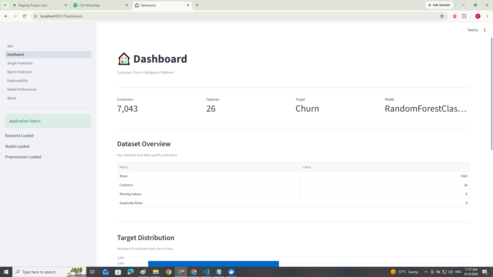

#### Dashboard Dataset & Analytics

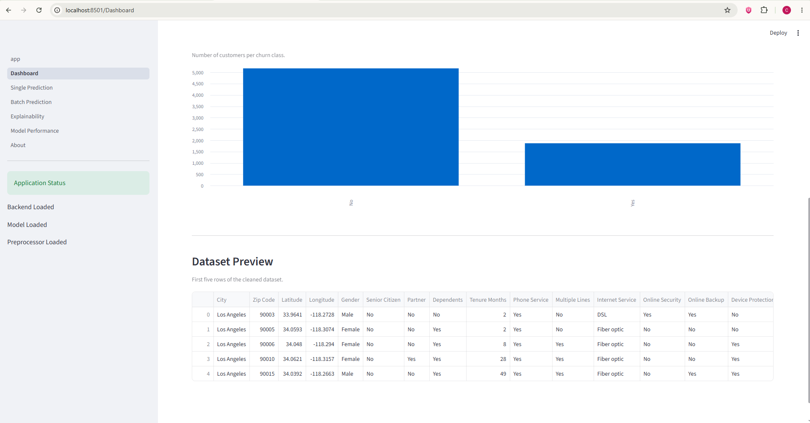

---

### 🎯 Single Customer Prediction

#### Customer Input

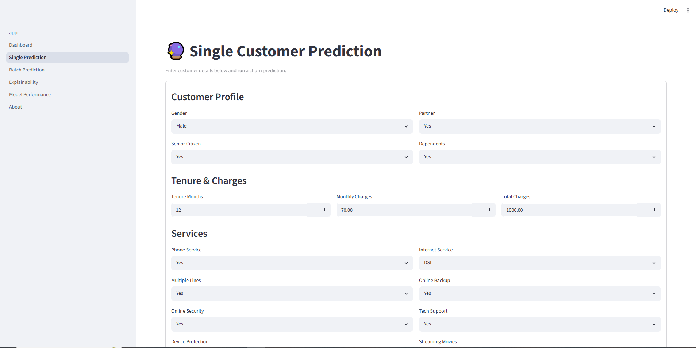

#### Prediction Result

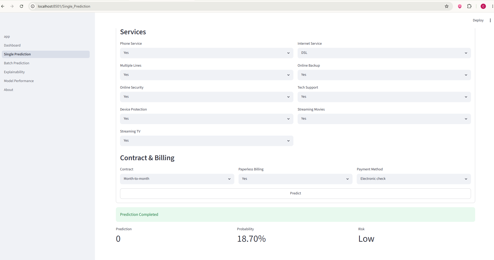

---

### 📊 Batch Prediction

#### Batch Prediction Results

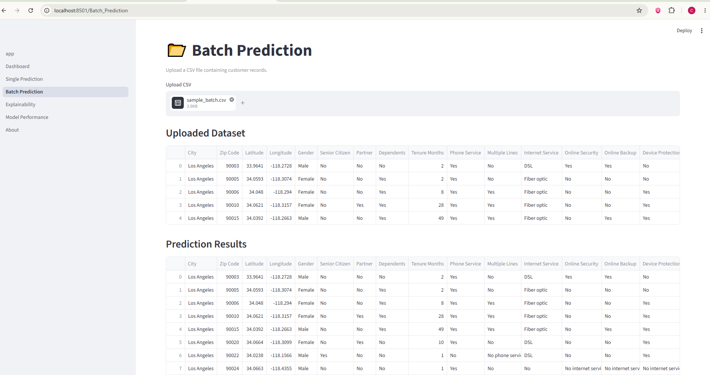

---

### 🔍 Explainable AI

#### Model Explainability

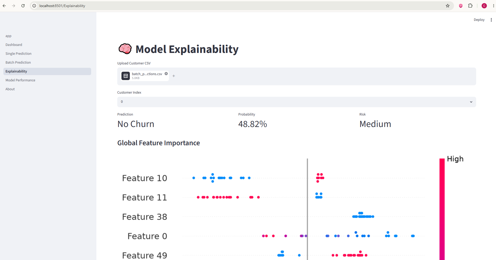

#### SHAP Explanation

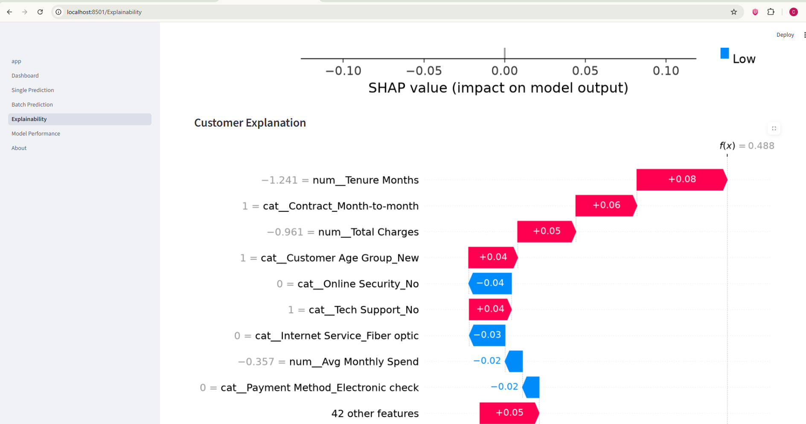

---

### 📈 Model Performance

#### Performance Overview

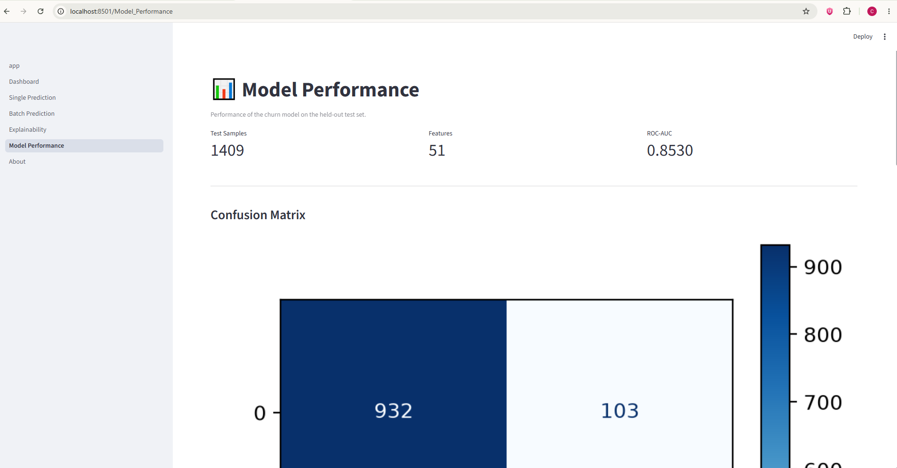

#### ROC Curve

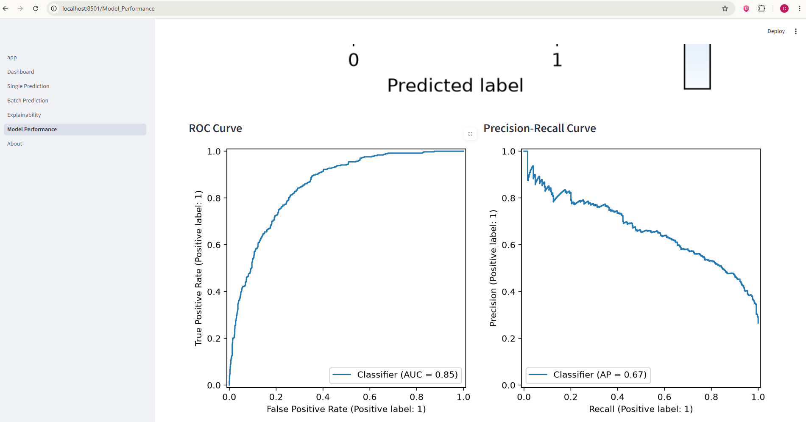

#### Detailed Performance

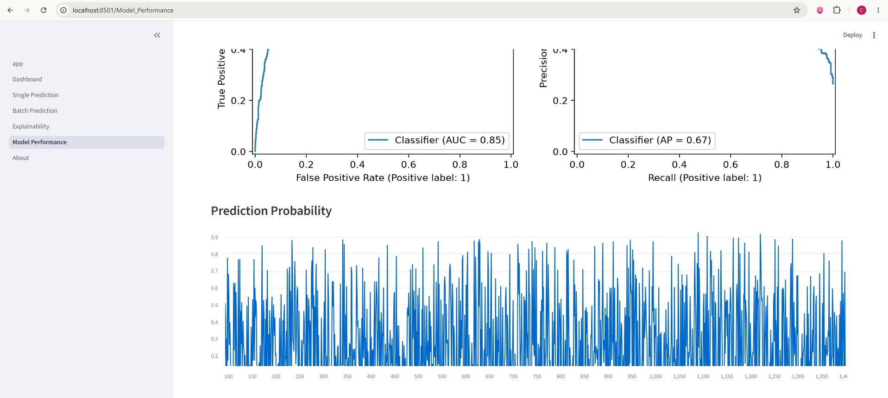

---

### 🔌 FastAPI

#### Swagger API Documentation

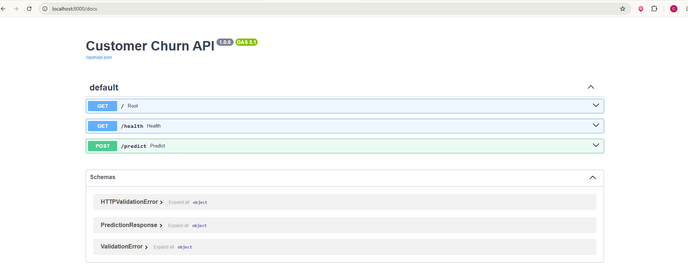

## 👨‍💻 Author

Hafiz Ahmad Adil

Machine Learning Engineer | AI Educator | IT Instructor

- GitHub: https://github.com/hafizahmadadilaiengineer
- LinkedIn: https://www.linkedin.com/in/hafizahmadadildurrani

## 📄 License

This project is intended for educational, portfolio, and demonstration purposes.
